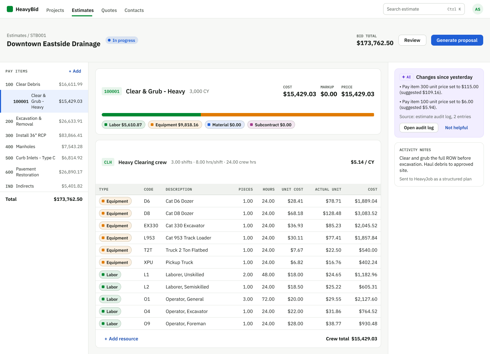
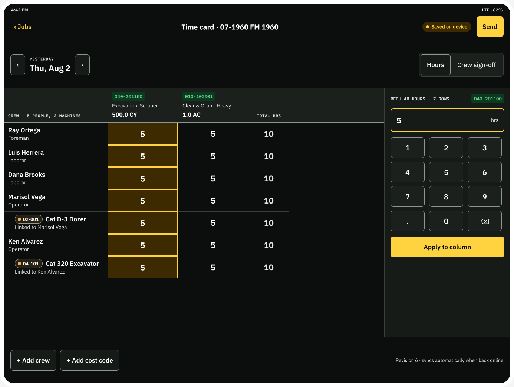
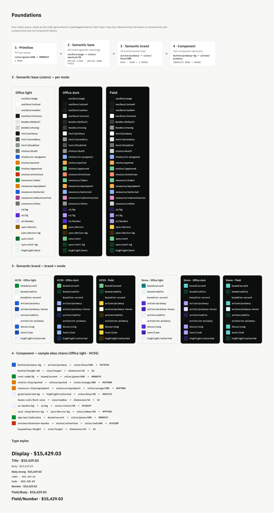

# Groundwork — a multi-product design system

**One token system and one component library powering two very different products:** a dense office web app for estimators and a field iPad app for foremen working in gloves, in sunlight, often offline.

| Office mode (web, estimators) | Field mode (iPad, foremen) |
|---|---|
|  |  |

Same components, same tokens. Switching mode changes two attributes on one wrapper and the whole UI re-skins: colors, contrast, touch-target size, row height and number size.

> **Case study context.** This is a self-initiated concept based on public demo videos of two construction products, HCSS HeavyBid (estimating) and HeavyJob (field time and production tracking). It is **not affiliated with or endorsed by HCSS**. Crew names are fictional and some values are illustrative.

---

## The problem

An audit of the two products' public demos showed they come from the same company but don't look like it:

- The brand color barely appears in either UI; one app alone uses four different blues.
- "Add" has seven different button treatments.
- The same data looks different in each product: a cost code is formatted two ways, people's names three ways, and estimate notes arrive in the field app as plain fixed-width text.
- Field screens use small tap targets and low-contrast states that are hard to use with gloves or in sunlight.

## The approach

1. **Audit and research:** product audit, competitor and user research (estimators, foremen, crews; 35% of the US construction workforce is Hispanic or Latino).
2. **Four token layers** so products, brands and environments can vary safely.
3. **One component library** in Figma and React with matching names and props.
4. **Two products rebuilt** from the same components: two office screens and three field screens.

## Token architecture



```
primitive  ──►  semantic base   ──►  semantic brand  ──►  component  ──►  apps
(raw values)    (meaning, per mode)  (brand roles,         (per-component    (use semantic +
                                      per brand × mode)     decisions)        component only)
```

| Layer | File | Varies by | Example |
|---|---|---|---|
| 1 Primitive | `packages/tokens/src/primitive.json` | — | `--color-green-600: #008933` |
| 2 Semantic base | `semantic-base.{office-light,office-dark,field}.json` | mode | `--surface-page`, `--size-target` (32px office, 56px field) |
| 3 Semantic brand | `semantic-brand.{hcss,demo}.json` | brand × mode | `--action-primary` (blue office, amber field) |
| 4 Component | `component.json` | inherits | `--button-primary-bg: var(--action-primary)` |

- **Semantic base** is what the UI *means* (surfaces, text, status, resource types, sizing) and is shared by every brand.
- **Semantic brand** is who the UI *belongs to*: 10 tokens (accent, primary action, focus, links). Adding a brand is one small file.

`packages/tokens/build.mjs` (no dependencies) turns the DTCG JSON into CSS variables and TypeScript types, and **fails the build** if:
- a semantic token references anything but a primitive,
- a component token references anything but a semantic token, or uses a raw color/px value,
- modes don't define the same token names, or a name collides across layers.

Component tokens are emitted on every `[data-mode]` wrapper so `var()` chains resolve against that wrapper's mode and brand; nesting a `ThemeProvider` re-themes a subtree.

## Repository structure

```
packages/tokens   4-layer design tokens (DTCG JSON) + build script → tokens.css, tokens.d.ts
packages/ui       React + TypeScript component library (35 components) + Storybook (42 stories)
apps/heavybid     Office web app: Estimate builder, Quote comparison
apps/heavyjob     Field iPad app: Time card + bilingual crew sign-off, Daily report review
```

## Run it

```bash
npm install
npm run dev:bid      # office app  → http://localhost:5173
npm run dev:job      # field app   → http://localhost:5174
npm run storybook    # components  → http://localhost:6006
npm run build        # tokens + typecheck + production builds of both apps
```

Each app has a dashed "Concept demo" bar with **Mode** (Office light / Office dark / Field) and **Brand** switches.

## Component library

Pages contain no styling of their own beyond page layout; everything visible is a library component, and component CSS uses **only component tokens** (no hex values, no semantic or primitive variables).

| Folder | Components |
|---|---|
| `packages/ui/src/components` (general) | Button, StatusChip, ResourceChip, SyncChip, CostCode, AIMarker, SegmentedControl, Switch, Label, Metric / MetricGroup, SectionHeader, Toolbar, Legend, Popover, RadioOption, Card, ProgressBar, AppBar, PageHeader, IPadNavBar, Stepper, DataGrid / GridCell, HoursCell, StatRow, Keypad / KeypadKey, SignOffQuestion, AISourcePopover, ReviewEntry |
| `packages/ui/src/domain` (construction-specific, shared across products) | PayItemList, CostBreakdown, AIInsight, DateStepper, CrewMemberCell, TimeCardGrid, TodaysPlan |

### Highlights
- **Field mode:** 56px touch targets, 60px rows, 22px numbers, high-contrast palette; off states never rely on color alone.
- **Bilingual sign-off:** English with Spanish underneath, full-width Yes · Sí / No.
- **AI trust pattern:** one AI marker everywhere; it opens the source, a confidence level and Accept / Edit / Revert. Agent drafts are reviewed item by item.
- **Shared domain components:** one cost code format, one crew/equipment format and one resource-type color set across both products.
- **Number formatting** in `packages/ui/src/format.ts`: money always 2 decimals, quantity decimals by unit, empty values as "—".

## Figma ↔ React parity

The Figma library mirrors this repo: the same four variable collections (Primitive, Semantic base, Semantic brand with 6 modes, Component) with matching CSS code syntax, and components with matching names and properties.

| Figma component (properties) | React component (props) |
|---|---|
| Button (Style, Size, State, Label, Show plus) | `Button` (variant, size, disabled, children, showPlus) |
| Status chip (Status) | `StatusChip` (status) |
| Resource chip (Type) | `ResourceChip` (type, label) |
| Segment (Selected, Label) | `SegmentedControl` (options, value, onChange) |
| Switch (State, Label) | `Switch` (checked, onChange, label) |
| App bar (Active, Product, Search placeholder, Initials) | `AppBar` (active, product, searchPlaceholder, initials) |
| Page header (Breadcrumb, Title, Metric, Show secondary) | `PageHeader` (breadcrumb, title, status, metric, secondaryAction, primaryAction) |
| Grid cell (Kind, Align, Highlight, Value, Show AI, Show tag, Tag) | `GridCell` / `DataGrid` (kind, align, highlight, showAI, tag) |
| Hours cell (Selected, Hours) | `HoursCell` (selected, value) |
| Sign-off question (Answer, English, Spanish) | `SignOffQuestion` (answer, english, spanish) |
| AI source popover (Title, Source, Confidence) | `AISourcePopover` (title, source, confidence, level) |
| Review entry (State, Source, Entry, Evidence) | `ReviewEntry` (state, source, entry, evidence) |
| Pay item list, Cost breakdown, AI insight, Date stepper | `PayItemList`, `CostBreakdown`, `AIInsight`, `DateStepper` |
| Crew member cell (Type), Time card grid, Today's plan | `CrewMemberCell`, `TimeCardGrid`, `TodaysPlan` |

## Process and tools

Designed and built by **Anusha Saripella**. I used Claude (Anthropic) as an accelerator for scaffolding, Figma automation through the Figma MCP server, and research. The architecture, component decisions and reviews are mine, including catching and fixing issues such as a token name that resolved to itself, component tokens that didn't re-resolve when the mode changed, and a screen that silently lost its Field mode.

## What I'd do next
- Validate Field mode and the bilingual sign-off with real foremen on rugged tablets.
- Add Storybook accessibility and visual-regression tests, plus automated contrast checks per brand.
- Generate the brand list from the token files, and add a Figma ↔ JSON drift check (Figma MCP / Variables API).
- Code Connect mappings so Figma Dev Mode shows the real React components.

## Notes
- npm may report that esbuild's install script was not run; the builds work without it. Run `npm install-scripts approve esbuild` if Vite ever fails to start.
